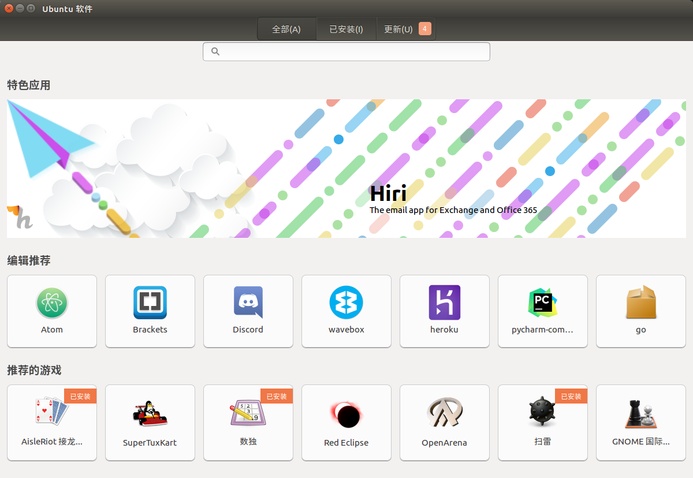

<!--
$theme: gaia
template: gaia
-->


Unix
GNU/Linux基础
三、常用软件的安装与使用<p style="text-align:right;font-size:28px;margin-right:50px;color:#cFc;">:star: by calidion</p>
===
---
Linux软件的安装方式
===
1. 软件市场（GUI）
2. 软件库(CLI）(apt, yum, pacman)
3. 下载安装包(.deb, .rpm)
4. 下载编译好的压缩包(.tar.gz)
5. 源码安装（基于configure、make & make install)

---
软件市场安装
===
---


---
软件库安装（Ubuntu)
===
debian系的软件包管理命令:

***apt***

  list - 根据名称列出软件包
  search - 搜索软件包描述
  show - 显示软件包细节
  install - 安装软件包
  remove - 移除软件包
  autoremove - 卸载所有自动安装且不再使用的软件包
  update - 更新可用软件包列表
  upgrade - 通过 安装/升级 软件来更新系统


---
apt软件管理
===
1. 安装


```apt install -y planner```

2. 删除

  普通删除

```apt remove -y planner```

  删除配置文件

```apt remove -y --purge planner```

---
apt软件管理(二)
===

3. 更新库信息

```apt update```

4. 升级软件

```apt -y upgrade```

5. 查找软件

```apt -y search```

---
安装与使用日常软件
===
1. 办公软件
Libre Office
Open Office

2. 视频播放软件
Totem
smplayer

3. 邮件接收软件
thunderbird
evolution

---
安装与使用日常软件（二)
===
4. 编辑器
vim
emacs
gedit
vscode

5. 浏览器
Chromium
Firefox

6. 图形处理
GIMP
dia

---
安装与使用日常软件（三)
===

7. 翻墙软件
tor-browser
shadowsocks

8. 电子书阅读
calibre

9. 思维导图
freeplane

10. 虚拟机
virtualbox


